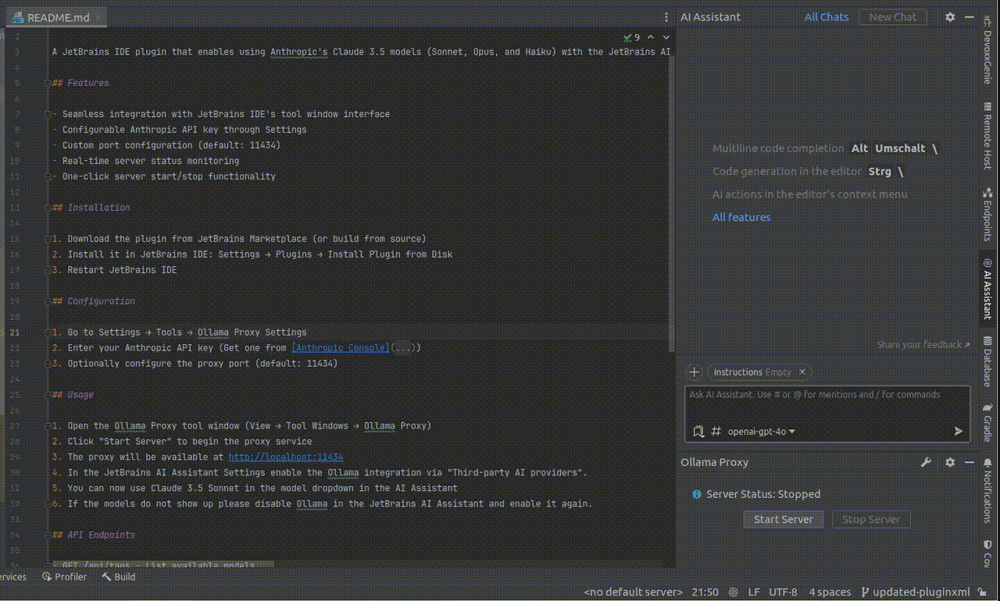

# Ollama Proxy Plugin for JetBrains IDE

A JetBrains IDE plugin that enables using Anthropic's Claude 3.5 models (Sonnet, Opus, and Haiku) with the JetBrains AI Assistant. It works by providing a proxy that mimics the Ollama API format, allowing you to use Claude models through the AI Assistant's "Enable Ollama" feature in the Third-party AI providers settings.

## Features

- Seamless integration with JetBrains IDE's tool window interface
- Configurable Anthropic API key through Settings
- Custom port configuration (default: 11434)
- Real-time server status monitoring
- One-click server start/stop functionality

## Installation

1. Download the plugin from JetBrains Marketplace (or build from source)
2. Install it in JetBrains IDE: Settings → Plugins → Install Plugin from Disk
3. Restart JetBrains IDE

## Configuration

1. Go to Settings → Tools → Ollama Proxy Settings
2. Enter your Anthropic API key (Get one from [Anthropic Console](https://console.anthropic.com/settings/keys))
3. Optionally configure the proxy port (default: 11434)

## Usage

1. Open the Ollama Proxy tool window (View → Tool Windows → Ollama Proxy)
2. Click "Start Server" to begin the proxy service
3. The proxy will be available at http://localhost:11434
4. In the JetBrains AI Assistant Settings enable the Ollama integration via "Third-party AI providers".
5. You can now use Claude 3.5 Sonnet in the model dropdown in the AI Assistant
6. If the models do not show up please disable Ollama in the JetBrains AI Assistant and enable it again.

## API Endpoints

- GET /api/tags - List available models
- POST /api/chat - Chat completion endpoint
- POST /api/show - Get model details

## Building from Source

./gradlew buildPlugin

The plugin ZIP file will be created in build/distributions/.

## Requirements

- JetBrains IDE 2023.1 or later
- Java 17 or later
- Valid Anthropic API key

## License

This project is licensed under the MIT License.
